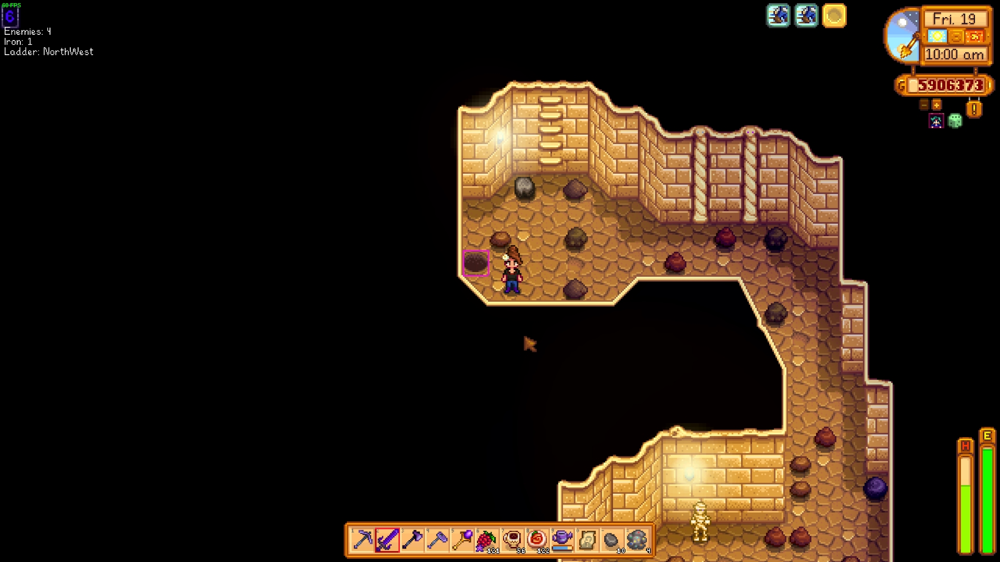

# Assistant Overlays #
A Stardew Valley mod utilizing SMAPI to draw colored rectangles around important objects.  
Currently tracked objects include:
* Truffles produced by pigs
* Ladders and shafts
* Rock crabs (the annoying monsters that look like rocks)
* Which stone has a ladder or shaft underneath it (the main feature, in my opinion)

## HOW TO INSTALL ##
*A more complete guide can be found on the stardew valley wiki here: https://stardewvalleywiki.com/Modding:Player_Guide/Getting_Started*
1. Install SMAPI (https://smapi.io/)
2. Unzip AssistantOverlays*.zip into the Mods folder in your Stardew Valley game directory

## CREDIT ##
This mod started out as a port of the (at the time) outdated LadderLocator mod by ChaosEnergy (https://www.nexusmods.com/stardewvalley/mods/3094).

## SCREENSHOTS ##

